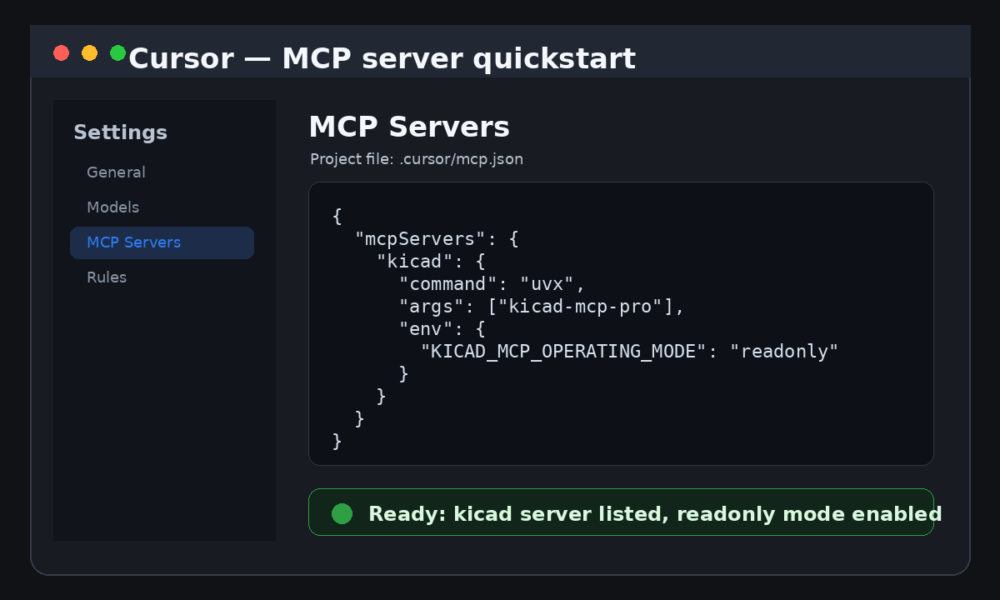

# Cursor Integration

## Quick Start

```bash
kicad-mcp-pro setup cursor
```

Or manually:

1. Copy `.cursor/mcp.json`:

```json
{
  "mcpServers": {
    "kicad": {
      "command": "uvx",
      "args": ["kicad-mcp-pro"],
      "env": {
        "KICAD_MCP_PROJECT_DIR": ".",
        "KICAD_MCP_PROFILE": "analysis",
        "KICAD_MCP_OPERATING_MODE": "readonly"
      }
    }
  }
}
```

2. Copy Cursor Rule: `integrations/cursor/rules/kicad.mdc` → `.cursor/rules/kicad.mdc`
3. (Optional) Copy Skill: `integrations/cursor/skills/kicad-pcb-review/` → `.cursor/skills/`


## Quickstart screenshot



This sanitized screenshot shows the expected project-scoped `.cursor/mcp.json` shape and the important onboarding posture: the `kicad` server is present and `KICAD_MCP_OPERATING_MODE` starts in `readonly` mode. It intentionally uses no private project path, token, or user-specific workspace name.

## Verification

In Cursor Agent mode, ask:
> *Use kicad MCP to inspect this project.*

## Example Prompt

> Use the kicad MCP server. Inspect this KiCad project, run DRC and ERC, and summarize the results. Do not modify files.
