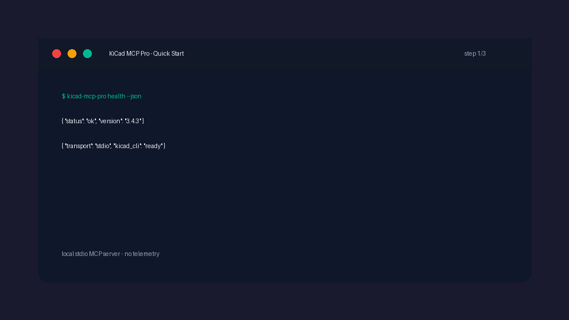

# Demo

This page collects the short demo media used by the README and release/reviewer flows.



## What the demo shows

The current bundled demo is a deterministic, redacted terminal capture. It shows a safe first-run posture for KiCad MCP Pro:

1. run a health check;
2. inspect doctor output;
3. start the MCP server;
4. confirm that the server is ready for an MCP-capable client.

The demo is intentionally conservative. It does not claim fabrication readiness and does not include real project paths, hostnames, API tokens, or private design files.

## Try a first agent prompt

```text
Open the current KiCad project, inspect the schematic hierarchy, list ERC-relevant issues, render a schematic preview, and explain what changed without modifying files.
```

For agent setup, see the [AI agent setup docs](agents/index.md). For a live-preview workflow that produces visual evidence after schematic edits, see [Safe live-preview workflow](workflows/live-preview.md).

## Source files

- GIF: [`assets/demo.gif`](assets/demo.gif)
- Asciinema cast: [`assets/demo.cast`](assets/demo.cast)
- Maintenance notes: [`demo-media.md`](demo-media.md)
