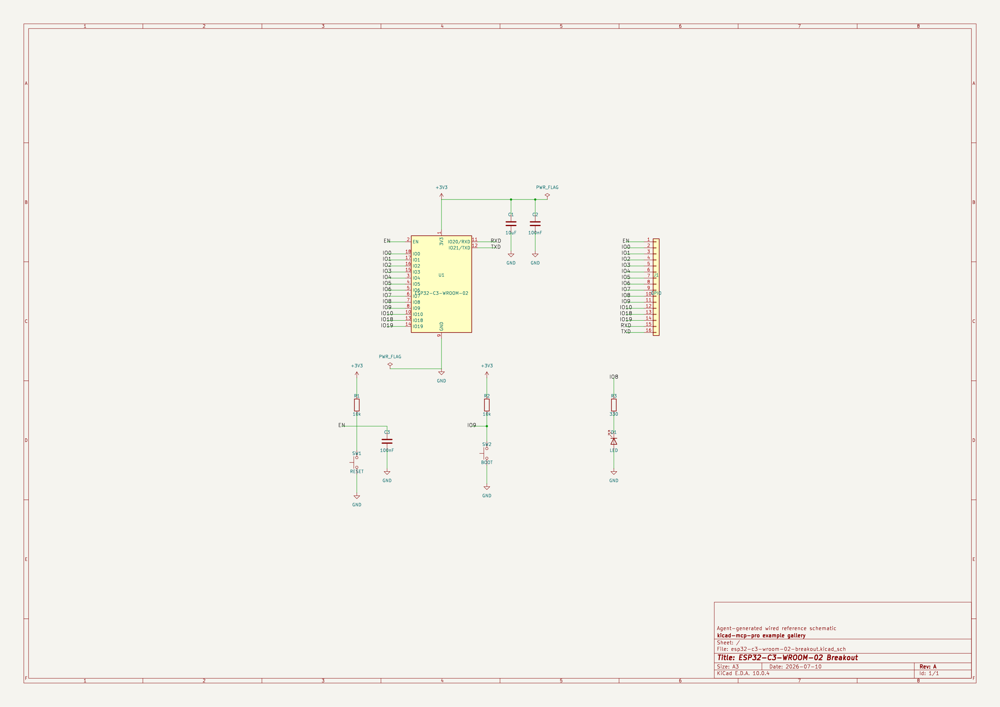

# ESP32-C3-WROOM-02 Breakout — wired reference schematic



An agent-generated, **ERC-clean** schematic built entirely through KiCad MCP Pro
placement and wiring tools. It is the reference example for the
[`wired-subcircuit-design`](../../../skills/wired-subcircuit-design/SKILL.md)
skill: it shows the difference between a *correct* schematic and a *professional*
one.

## What makes it a showcase (not just valid)

- **Wired sub-circuit islands, not floating labels.** The decoupling caps, the
  EN reset network (R1 / C3 / SW1), the boot strap (R2 / SW2) and the status LED
  (R3 / D1) are drawn as real wired blocks with power symbols — the way a person
  draws them — instead of every pin dangling its own net label.
- **A tidy breakout bus.** The general-purpose IO, RXD and TXD connect U1 to
  header `J1` through matched local labels generated from one source list, so
  every net appears on both ends (no isolated single-label nets).
- **Conventional power.** `+3V3` up, `GND` down, one `PWR_FLAG` on each supply so
  ERC sees the rails as driven.
- **A complete title block** and no overlapping graphics.

## Verify it yourself

```bash
kicad-cli sch erc esp32-c3-wroom-02-breakout.kicad_sch      # 0 violations
kicad-cli sch export svg -o render esp32-c3-wroom-02-breakout.kicad_sch
```

## Regenerate it

The schematic is reproducible from `generate.py`, which drives the same
`sch_build_circuit` / `run_erc` tools an agent would call. It needs the KiCad 10
system symbol libraries (`RF_Module`, `Device`, `Switch`, `Connector_Generic`)
and `kicad-cli`. See the script header for the single-pass build rationale.

## Design notes

| Block | Parts | Net |
|-------|-------|-----|
| Module | U1 ESP32-C3-WROOM-02 | — |
| Bulk / decoupling | C1 10µF, C2 100nF | +3V3 / GND |
| Reset | R1 10k, C3 100nF, SW1 | EN |
| Boot strap | R2 10k, SW2 | IO9 |
| Status LED | R3 330, D1 | IO8 |
| Breakout | J1 1×16 | EN, IO0–IO10, IO18, IO19, RXD, TXD |

The schematic is self-contained: symbol definitions are cached in `lib_symbols`,
so it renders and runs ERC without the system libraries installed.
